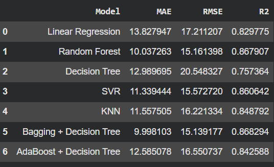

Predictive Maintenance Pipeline: Turbofan Engine RUL
# Predictive Maintenance Pipeline: Turbofan Engine RUL

https://predictive-maintenance-ml-nrg6d97a6cbrt5y4irykm8.streamlit.app/

## 1. Project Overview
This project implements a machine learning pipeline for predictive maintenance, specifically designed to estimate the Remaining Useful Life (RUL) of turbofan engines. By analyzing time-series sensor data and operational settings, the model predicts how many cycles an engine has left before failure. The project includes automated data profiling, robust feature engineering, model evaluation, and an interactive web interface built with Streamlit for real-time predictions.

## 2. Required Files
To run the pipeline and the Streamlit app successfully, ensure you have the following files in your project directory:

Dataset Files:

train_FD001.txt: Run-to-failure simulation data for training.

test_FD001.txt: Operational data for testing unseen engines.

RUL_FD001.txt: Ground truth RUL values for the test set.

Code Files:

notebook.ipynb (or .py equivalent): The main script containing data processing, feature engineering, and model training.

app.py: The Streamlit web application script.

Generated Artifacts (created after running the notebook):

bagging_rul_model.pkl: The serialized and trained machine learning model.

nasa_report.html: The automated exploratory data analysis report.

## 3. Models & Results
The pipeline utilizes a GroupShuffleSplit (grouped by engine ID) to prevent data leakage and evaluates several algorithms to find the best fit for predicting RUL:

Models Tested: Linear Regression, Decision Tree, Random Forest, Support Vector Regressor (SVR), K-Nearest Neighbors (KNN), AdaBoost, and Bagging Regressor.

Feature Engineering: We applied a piece-wise linear degradation target (capping max RUL at 125 cycles), and extracted rolling means, rolling standard deviations (window size = 5), and polynomial features (squared cycles).

Final Results: The Bagging Regressor (using a Decision Tree base) outperformed the other models based on Mean Absolute Error (MAE), Root Mean Squared Error (RMSE), and R² scores. It was selected as the final model for deployment.

## 4. Setup and Installation
Ensure you have Python 3.8+ installed. You can install all the required dependencies using pip. Open your terminal or command prompt and run:

Bash
pip install pandas numpy scikit-learn ydata-profiling joblib streamlit
## 5. Running the Application
Once the libraries are installed and the model (bagging_rul_model.pkl) is generated from your notebook, you can launch the interactive web interface.

Run the following command in your terminal in the same directory as app.py:

Bash
streamlit run app.py
This will open a new tab in your default web browser (usually at http://localhost:8501) where you can interact with the model and input engine data to get RUL predictions.

## 6. Limitations & Future Work
Limitations
Simulated Data: The model is trained on the NASA C-MAPSS dataset, which is simulated. It may not perfectly capture the complex, unpredictable noise of real-world physical sensors.

Linear Degradation Assumption: The piece-wise target transformation assumes that engine degradation is negligible until 125 cycles before failure, which might oversimplify wear-and-tear for some engines.

Static Window Size: Rolling features use a fixed window size of 5. This might miss long-term temporal dependencies in the engine's early life.

## 7. Future Work
Deep Learning Integration: Implement Recurrent Neural Networks (RNNs) or LSTMs (Long Short-Term Memory) to better capture complex temporal sequences without relying entirely on manual feature engineering.

Testing Across Datasets: Expand the pipeline to train and evaluate on the other NASA datasets (FD002, FD003, FD004) to handle multiple operating conditions and fault modes.

Cloud Deployment: Containerize the Streamlit application using Docker and deploy it to a cloud service (e.g., AWS, Heroku, or Streamlit Community Cloud) for public access.
